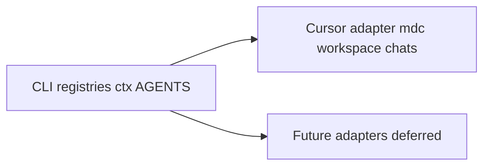

# Integrations

Metra's **brain** is portable. **Cursor** is the first harness adapter.



## Runtime requirement

- **PowerShell** - required for `meta.ps1` / `Meta.psm1` today.
- **Cursor** - optional. Needed for automatic persona load (`.cursor/rules`), Ask/Plan Teaching Mode hooks, and `chats` transcript search.

## What works without Cursor

| Capability | How |
|------------|-----|
| Discover / list / status / pull / run | `.\meta.ps1 ...` |
| Routing table | `.\meta.ps1 routing` |
| Context pack | `.\meta.ps1 ctx` then open, paste, or attach the file |
| Profile move between machines | `export-profile` / `import-profile` |
| Shared + local registries | `projects.json`, `projects.local.json`, root `registryFile` |
| Agent entry docs | this repo's `AGENTS.md` + each project's `AGENTS.md` |

## What Cursor adds

| Capability | Where |
|------------|--------|
| Always-on Metra persona + overlay | `.cursor/rules/metra-persona.mdc` (+ local overlay) |
| Teaching Mode in Ask/Plan | Same rule; intent-based triggers also apply elsewhere |
| Multi-root workspace file | `.\meta.ps1 workspace` (optional) |
| Prior chat search | `.\meta.ps1 chats` (reads Cursor agent transcripts) |

## Universal handoff with `ctx`

```powershell
.\meta.ps1 ctx
.\meta.ps1 ctx -Query "your topic"
```

Default outputs (gitignored): `docs/context-pack.md` and `docs/context-pack.json`.

Use the pack with **any** coding agent: `@` in Cursor, attach/paste in Claude Code / Codex / other chats. Prefer `ctx` over dumping `canvas-snapshot.json` or full registries.

## Future adapters (deferred)

Claude Code, Codex, Copilot, and similar tools are **not** generated in this pass. Pattern when adding one:

1. Keep CLI + registries + `ctx` + `AGENTS.md` as the source of routing truth.
2. Map portable guidance into that tool's native rule/instruction file.
3. Do **not** fork a second Metra personality - one product voice, adapter-specific load paths only.

## Related docs

- [README.md](../README.md) - quick start and core vs Cursor
- [Customizing-Metra.md](Customizing-Metra.md) - persona and overlays
- [Context-Routing.md](Context-Routing.md) - registries and audit
- [AGENTS.md](../AGENTS.md) - short agent entry
