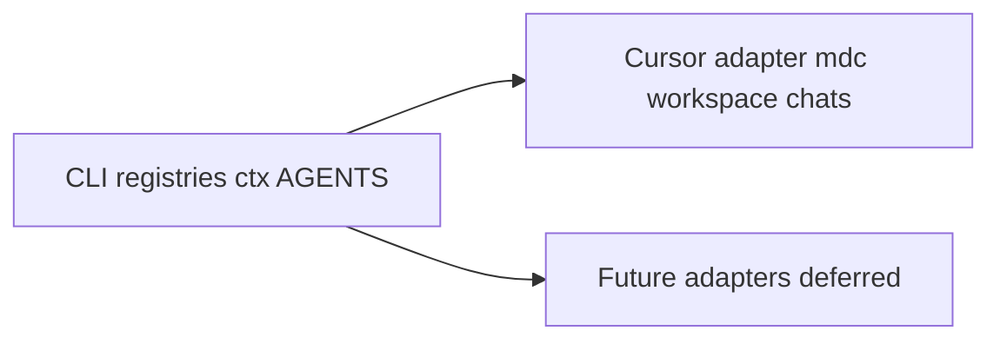

# Integrations

Metra's **brain** is portable. **Cursor** is the first harness adapter.



## Runtime requirement

- **PowerShell** - required for `metra.ps1` and the `scripts/Metra.psd1` module.
- **Cursor** - optional. Needed for automatic persona load (`.cursor/rules`), Ask/Plan Teaching Mode, `chats` transcript search, and `sessionStart` Ops refresh (`.cursor/hooks`).

## What works without Cursor

| Capability | How |
|------------|-----|
| Discover / list / status / pull / run | `.\metra.ps1 ...` |
| Routing table | `.\metra.ps1 routing` |
| Context pack | `.\metra.ps1 ctx` then open, paste, or attach the file |
| Profile move between machines | `export-profile` / `import-profile` |
| Shared + local registries | `projects.json`, `projects.local.json`, root `registryFile` |
| Agent entry docs | this repo's `AGENTS.md` + each project's `AGENTS.md` |
| Durable Metra decisions | [Decisions.md](Decisions.md) (append-only; prefer before transcript dig) |
| Ask journal / Capture CLI | `.\metra.ps1 ask sessions`, `.\metra.ps1 capture list` |
| Ask engine (Ollama recommend) | `.\metra.ps1 ask recommend`, `ask accept`, `ask engine show|set`, `ask key set` |
| Azure DevOps remote evidence | `.\metra.ps1 azdo status`, `azdo gaps`, `azdo get` (PAT required; see [Azdo.md](Azdo.md)) |
| Routing smoke | `.\metra.ps1 verify` |

## What Cursor adds

| Capability | Where |
|------------|--------|
| Always-on Metra persona + overlay | `.cursor/rules/metra-persona.mdc` (+ local overlay) |
| Teaching Mode in Ask/Plan | Same rule; intent-based triggers also apply elsewhere |
| Multi-root workspace file | `.\metra.ps1 workspace` -> `Metra.code-workspace` (optional; orchestration folder labeled **Metra**) |
| Metra Ops board | `.\metra.ps1 snapshot` installs/refreshes one `metra-ops-board.canvas.tsx` (Route / Portfolio / Stewardship). Route opens with a capped Needs attention queue and Resolve this classifier; the sticky tab bar keeps all three views reachable. Component code refreshes on template drift; data every run. Board is a retrieval surface - durable writes stay in CLI/chat. |
| Metra Ops webview (VS Code / Cursor) | Optional IDE shell: install `integrations/vscode-metra-ops` (Extensions: Install from Location), then **Metra Ops: Open Desk**. Bridge messages are `requestProposalApply` / `askInChat` / `openWorkspacePath` / `copyText` (never bare apply). Disk apply stays on the tray Host. Plain browser desk still works without the extension. |
| Metra self-documentation | Visual explain surface (not the ops desk). Refresh with `.\metra.ps1 selfdoc` after registry route/trigger changes (`snapshot` also runs it). Template `integrations/cursor/metra-self-documentation.canvas.tsx.template`; live canvas under Cursor projects `canvases/`. Prose twin: `docs/Overview.md`. Sidecar: `docs/selfdoc-routes.json`. |
| Prior chat search | `.\metra.ps1 chats` (reads Cursor agent transcripts) |
| Stale Ops refresh on chat start | `.cursor/hooks.json` `sessionStart` -> `.cursor/hooks/session-snapshot.ps1` |

## MCP tool bindings

Routing decides **where** work happens; MCP servers decide **what tools** the agent can reach. Bindings are per-machine, so a clone of Metra does not inherit them. Tracked starter: [`integrations/cursor/mcp.example.json`](../integrations/cursor/mcp.example.json).

| Server | Endpoint | Auth | Used for |
|--------|----------|------|----------|
| Canva | `https://mcp.canva.com/mcp` | Per-user browser OAuth | Brand kits, brand templates, design create / edit / export for printables |

Install by copying the example into one of:

| Target | Scope |
|--------|-------|
| `%USERPROFILE%\.cursor\mcp.json` | Every workspace on this machine |
| `<checkout>\.cursor\mcp.json` | This checkout only |

Reload MCP servers afterward; the first tool call opens the browser OAuth prompt.

Rules for this repo:

- Tracked files carry **URL-only** entries. Anything with `headers`, tokens, or API keys belongs in the local `mcp.json`, which is gitignored - see [SECURITY.md](../SECURITY.md).
- Bindings are **optional**. When a server is absent, say it is not connected and continue with local tooling instead of inventing a workflow around it.
- Per-user OAuth means each operator authorizes their own account. Sharing the pointer never shares access.

## sessionStart vs IDE load

Cursor **project hooks** run on **agent chat session start**, not when you open the IDE window or reload the workspace.

| Action | Auto? |
|--------|-------|
| Refresh Ops board when snapshot is stale (`snapshot -Quick`) | Yes - `sessionStart` hook (fail-open; never blocks chat) |
| Rebuild `Metra.code-workspace` | **No** - run `.\metra.ps1 workspace` manually when folders change (auto-rewrite can reload Cursor mid-session) |

Stale means: snapshot older than 4 hours, **or** `projects.json` / `projects.local.json` / `metra.config.json` / root `registryFile` newer than `docs/canvas-snapshot.json`.

### Quick vs full snapshot

```powershell
.\metra.ps1 snapshot -Quick   # registry + present/missing + AGENTS/.cursorignore/README; no deep scan, no git counts
.\metra.ps1 snapshot          # full quiet audit + git counts (deliberate refresh)
```

Plain English is preferred over slash commands for this operator. Ask to refresh the Ops board when needed; the sessionStart hook covers the common stale case.

### Multi-root search echo

After routing, scope Grep/Glob to one absolute project path. See [Search-Echo.md](Search-Echo.md).

## Universal handoff with `ctx`

```powershell
.\metra.ps1 ctx
.\metra.ps1 ctx -Query "your topic"
```

Default outputs (gitignored): `docs/context-pack.md` and `docs/context-pack.json` (title: **Metra context pack**).

Use the pack with **any** coding agent: `@` in Cursor, attach/paste in Claude Code / Codex / other chats. Prefer `ctx` over dumping `canvas-snapshot.json` or full registries.

## Future adapters (deferred)

Claude Code, Codex, Copilot, and similar tools are **not** generated in this pass. Pattern when adding one:

1. Keep CLI + registries + `ctx` + `AGENTS.md` as the source of routing truth.
2. Map portable guidance into that tool's native rule/instruction file.
3. Do **not** fork a second Metra personality - one product voice, adapter-specific load paths only.

## Related docs

- [README.md](../README.md) - quick start and core vs Cursor
- [Brand.md](Brand.md) - operator-facing palette and professional sink
- [Customizing-Metra.md](Customizing-Metra.md) - persona, Origin, and overlays
- [Context-Routing.md](Context-Routing.md) - registries, audit, Metra Ops board
- [Search-Echo.md](Search-Echo.md) - multi-root Grep echo and path scoping
- [Decisions.md](Decisions.md) - append-only portfolio decisions
- [ops/README.md](../ops/README.md) - Ask + Capture HTTP contract for native clients
- [Routing-Scenarios.md](Routing-Scenarios.md) - routing / persona smoke + `verify` fixtures
- [Overview.md](Overview.md) - audience overview / leave-behind (prose twin of self-doc canvas)
- Self-doc canvas template: `../integrations/cursor/metra-self-documentation.canvas.tsx.template` (install/live under Cursor projects `canvases/`)
- [AGENTS.md](../AGENTS.md) - short agent entry
