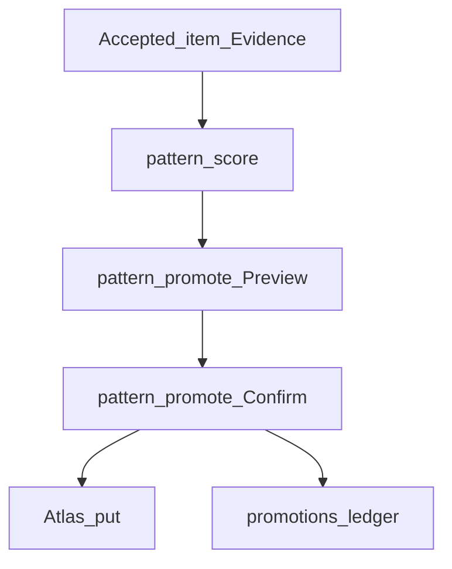

# Guild Knowledge Promotion Pattern

## Intent

Governs accept-gated scoring and Atlas publication of Pattern discoverability copies (Slice 8). Loom owns score/promote; Atlas publishes only.

## Actors

| Actor | Role |
|-------|------|
| `Invoke-MetraLoomPatternScore` | Lists promote candidates from accepted Evidence |
| `Invoke-MetraLoomPatternPromote` | Preview/Confirm gate; writes promotion ledger |
| Atlas put adapter | Local object; optional `-Publish` |
| Operator | Confirms promote; never transfers Pattern authority |

## Inputs / outputs

**In:** Accepted queue item; `docs/patterns/**` paths changed in baseline..completedCommit; validated Pattern front matter; content hash at accepted revision.

**Out:** Score report; Preview eligibility; Confirm → Atlas put (`pattern:<patternId>`) + `patterns/promotions.json` ledger + journal `pattern-promote`.

## Rules and ceilings

1. Item status must be `accepted` (not `completed`, not `accepted-pending-commit`).
2. Target path must stay under `docs/patterns/` after normalization (fail closed on escape/absolute).
3. Pattern must appear in the accepted commit range diff.
4. Working tree hash must match blob at accepted revision.
5. Same `patternId` + `contentHash` already promoted → reject.
6. Missing cite/file → not eligible; malformed front matter → reject that Pattern.
7. Publication does not transfer authority from the tracked file.

## State / contract refs

- Ledger: `{loomRoot}/patterns/promotions.json`
- StableId: `pattern:<patternId>`
- Atlas: put local unless `-Publish`

## Flow



## Human ritual

```powershell
.\metra.ps1 loom pattern score
.\metra.ps1 loom pattern promote -Path .\docs\patterns\guild\knowledge-promotion.md -Preview
.\metra.ps1 loom pattern promote -Path .\docs\patterns\guild\knowledge-promotion.md -Confirm
.\metra.ps1 loom pattern promote -Path .\docs\patterns\guild\knowledge-promotion.md -Confirm -Publish
```

## Anti-patterns

- Promoting from `completed` without daily accept
- Treating Atlas/Notion as authoritative Pattern store
- Auto-writing Pattern bodies from gap candidates
- Special-casing `cabinet: guild` in eligibility code

## Evidence

- CLI: `loom pattern score|promote` in `Invoke-LoomCommand`
- Module: `modules/Loom/Private/PatternPromote.ps1`
- Tests: `tests/Metra.Loom.Tests.ps1` (Slice 8 Pattern promote)
