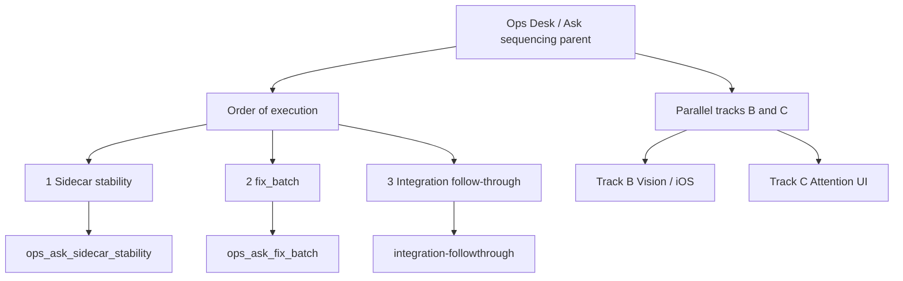

# Ops Desk / Ask sequencing (parent)

**Stem:** `ops-desk-ask-sequencing`
**Role:** Parent umbrella (same pattern as [`attention_2.0_forward_cb1ee20e.plan.md`](attention_2.0_forward_cb1ee20e.plan.md)) - organize and sequence children; do **not** merge child bodies.
**Home:** Metra (Yarn / Plan Board Subproject **OpsDesk** + **Ask**). Not a TicketTracker ticket.
**Status:** **Parked / Complete** (2026-10-09). Bing Approve of integration + operator retire. Amendment C still applies if a future child reopens Ask concurrency / `askBusy` / `/api/meta` / Ensure - revive this parent or create a new sequencing parent.

## Goal

One place to see **what ships next** on Ops/Ask without hunting ~30 Cursor leaves. Two children both rewrite [`OpsServer.ps1`](scripts/private/OpsServer.ps1) Ask behavior - without this parent, Loom/Surveyor can Approve them in either order and collide.

| Child leaf | Job |
|------------|-----|
| [`ops_ask_sidecar_stability_79118c68.plan.md`](ops_ask_sidecar_stability_79118c68.plan.md) | Remote reach / false offline |
| [`ops_ask_fix_batch_a72e390d.plan.md`](ops_ask_fix_batch_a72e390d.plan.md) | DEV-JMP01 CPU; Ask off accept-loop |

## Design

## Order of execution

Serialize Track A. Do **not** merge the two Ask children. Do **not** put async Ask worker work inside stability.

| Step | Plan / bite | Status | Pending | What it owns | Conflict surface |
|------|-------------|--------|---------|--------------|------------------|
| 0 | Foundation: `sidecar_complete_fix`, `metra_ops_host` / `ops_desk_coherence` | Shipped | 0 | Lease, health gate, Ensure recycle; tray Host→Ops→Ask | Cite only |
| **1** | [`ops_ask_sidecar_stability`](ops_ask_sidecar_stability_79118c68.plan.md) | **Shipped** (todos complete) | 0 | Phone timeout, Ask `/health` poll, Serve+meta, error taxonomy, Ops Scheduled Task | Accept-loop Ensure; `/api/meta` shape; iOS errors |
| **2a** | [`ops_ask_fix_batch`](ops_ask_fix_batch_a72e390d.plan.md) **P0a** | **Shipped** | 0 | Attention Project vs Reconcile; migrate `Get-MetraDeskPayload` callers | Desk payload / reconcile boundary |
| **2b** | same leaf **P0b** | **Shipped** (gate + worker) | 0 | SemaphoreSlim `askBusy` 409; Ask worker off accept-loop | Accept-loop rewrite; 409 contract |
| **2c** | same leaf **P1 → P2 → verify** | **Shipped** | 0 | Cost caps, caches, inspect | Telemetry must not share Ask gate |
| **3** | Parent todo `integration-followthrough` | **Shipped** (2026-10-09) | 0 | iOS `askBusy`; named mutex `ask-sidecar-ensure` on Ensure + Restart | Closed |
| 4 | Parent todo `retire-parent` | **Parked** (2026-10-09) | 0 | Park/Complete this parent | Closed |

**Current next bite:** none - parent parked. Future Ask-concurrency work must cite/revive sequencing (Amendment C).

### Integration ship notes (2026-10-09)

| Bite | Landed |
|------|--------|
| iOS `askBusy` | `AskClientError.askBusy`; `OpsAskClient` maps HTTP 409 + `error=askBusy` (never offline) |
| Named mutex Ensure | `Invoke-MetraWithNamedMutex -Name 'ask-sidecar-ensure'` on Ensure; Restart stop→start under same mutex + per-runspace depth for nested Start→Ensure |

### Hard gates

| Gate | Rule |
|------|------|
| Default order | Step 1 → 2a → 2b → 2c → 3 → 4 |
| Override | Only via [Override authority](#override-authority-amendment-a) note on **this** parent (date, what, why, operator). Chat / Loom receipt / child footnote do not count. |
| Future children | Any new plan that touches Ask lifecycle, concurrency, `askBusy`/409, `/api/meta`, or Ensure must `relatedPlans` cite this parent **before** Approve (Amendment C). |
| Merge ban | Do not merge stability + fix_batch into one plan. |

---

## Track A - Ops/Ask conflict lane (serialize)

Same children as the execution table; ownership detail for desk scan.

| Child | Status | Pending | Owns | Conflict |
|-------|--------|---------|------|----------|
| **ops_ask_sidecar_stability** | Shipped | 0 | Phone timeout, Ask `/health` poll, Serve+meta, error taxonomy, Ops Scheduled Task | Accept-loop Ensure; `/api/meta` shape; iOS errors |
| **ops_ask_fix_batch** | Shipped (all 6 todos complete) | 0 | Attention Project/Reconcile; SemaphoreSlim + Ask worker offload; cost caps | 409 `askBusy` + named mutex Ensure (parent step 3) shipped |
| sidecar_complete_fix | Shipped | 0 | Lease, health gate, Ensure recycle | Foundation only - cite; live SDK pin **1.0.26** (ignore obsolete 1.0.30 todo) |
| metra_ops_host / ops_desk_coherence | Shipped | 0 | Tray Host→Ops→Ask; desk UX | Cite ownership chain |

## Track B - Vision / iOS (parallel OK)

May ship beside Track A **unless** they change Ops accept-loop concurrency, Ask single-flight, or `/api/meta` without citing this parent. Prefer consuming stability meta/error contracts.

| Child | Pending | Note | Wait on Track A? |
|-------|---------|------|------------------|
| vision_cursor_identity_stack | 6 | Vision identity loader - VisionAsk, not accept-loop offload | No |
| ios_conversation_policy_wire | 1 | Residual policy wire | No |
| ios_phase_1_spike | 5 | Spike leftovers; HTTPS/Tailscale client | Prefer stable Serve (step 1) |
| metra_ios_no-mac | 9 | Work Mac / reach program | Depends on step 1 Serve visibility |

## Track C - Ops desk Attention UI

| Child | Pending | Note | Wait on Track A? |
|-------|---------|------|------------------|
| ops_itsm_ui_mining | 7 | Attention card UX / desk payload | Unblocked for Project vs Reconcile (**2a shipped**) |
| attention_2.0_forward | 4 | Separate **Attention** parent - cross-link only | No (different umbrella) |
| ticket_watch_* (affirm/bus; desk shipped) | 3+ | Sensors; Host poll later | Do not steal Ops Ask lifecycle |

## Outside this parent

No sequence gate unless the work edits `OpsServer` Ask paths: e.g. `tt_itsm_pattern_mining`, `orion_alert_desk`, `jitterbit_upgrade_policy`, `plan_index_per_project`, `github_public_audience_revision`, `inspect_runtime_verification` (parked), Scout (parked), routing soak, Atlas commit sessions. Capability routing - cite here only if it changes Ask engine bind.

---

## Parent duties

| # | Duty |
|---|------|
| 1 | Keep Track A order visible on Plan Board (OpsDesk / Ask). |
| 2 | Enforce future-child `relatedPlans` cite (Amendment C) before Approve. |
| 3 | After Track A children ship, complete or cancel `integration-followthrough`. |
| 4 | Do not invent a second Metra project or TicketTracker ticket for this. |

### Parent todos (this leaf)

| Todo | Status | When |
|------|--------|------|
| `affirm-parent` | completed | Surveyor Pack/Approve + index stem `ops-desk-ask-sequencing` |
| `link-children` | completed | Both Track A children cite this parent |
| `yarn-idea` | cancelled | Optional Capture skipped at retire |
| `integration-followthrough` | completed | Execution step 3 - shipped 2026-10-09 |
| `retire-parent` | completed | Execution step 4 - parked 2026-10-09 (Bing Approve + operator) |

## Override authority (Amendment A)

Track A order is the default gate for Loom / Surveyor / Yarn Approve of downstream Ask work.

**Any override must be recorded in this parent before approving out-of-order work.**

| Field | Required |
|-------|----------|
| Date (UTC) | yes |
| What is approved out of order | yes (e.g. fix_batch P0b before stability) |
| Why | one short paragraph |
| Operator | Stephen / display name |

### Override log

| Date (UTC) | What | Why | Operator |
|------------|------|-----|----------|
| *(none)* | | | |

Until a row exists here, out-of-order Approve of fix_batch P0b (or any third plan that changes Ask concurrency / Ensure / `/api/meta` ahead of stability) is **blocked**.

## Bing review (2026-09-21)

**Verdict:** Approve with minor amendments. Parent = portfolio coordination; children = implementation. Amendments A (override), B (retirement), C (future-child relatedPlans) folded above. Boundaries kept: Attention parent separate; TicketTracker not absorbed; OpsDesk/Ask stay portfolio categories.

## Yarn / Surveyor gate (after affirm)

| Action | Detail |
|--------|--------|
| Authority | Cursor leaf under `%USERPROFILE%\.cursor\plans\` |
| Index | Upsert stem `ops-desk-ask-sequencing` |
| Optional | Yarn idea "Ops Desk / Ask sequencing parent" linking both children |
| Children | Already point here in Related sections |

## Done when (coordination)

| Check | State |
|-------|-------|
| Both Track A children cite this parent + locked sequence | Done (`link-children`) |
| One plan shows what else is live on Ops/Ask | This leaf |
| Only Amendment A overrides Track A order | Active |

## Retire parent when (Amendment B)

Park / Complete (Surveyor archive / Yarn park) when **all** are true:

| # | Condition | 2026-10-09 |
|---|-----------|------------|
| 1 | `ops_ask_sidecar_stability` shipped (or cancelled with note here) | Met |
| 2 | `ops_ask_fix_batch` shipped (or cancelled with note here) | Met |
| 3 | Integration follow-through completed **or** cancelled on this parent | Met |
| 4 | No active child (pending todos) modifies Ask concurrency, `askBusy`, `/api/meta`, or Ensure | Met (Track A children shipped; Track B/C do not own those surfaces) |

**Retired 2026-10-09** after Bing Approve of integration (shared `ask-sidecar-ensure` mutex + iOS `askBusy`) and operator retire. Archival only - not an automatic Loom action. A later plan that reopens those surfaces must revive this parent or create a new sequencing parent and re-lock order.

**Ops note (Bing):** watch mutex timeout / restart delay / Ensure delay telemetry after rollout (`TimeoutMs 90000` on the shared lifecycle gate).
