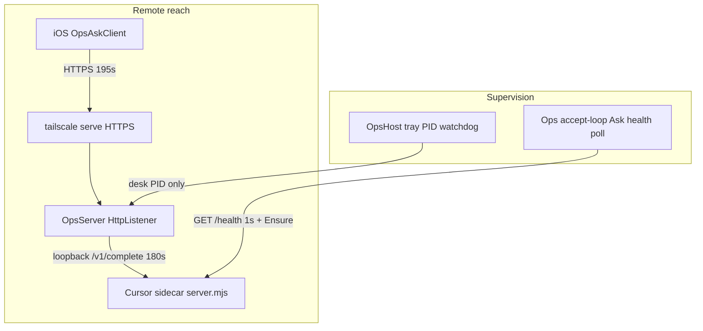
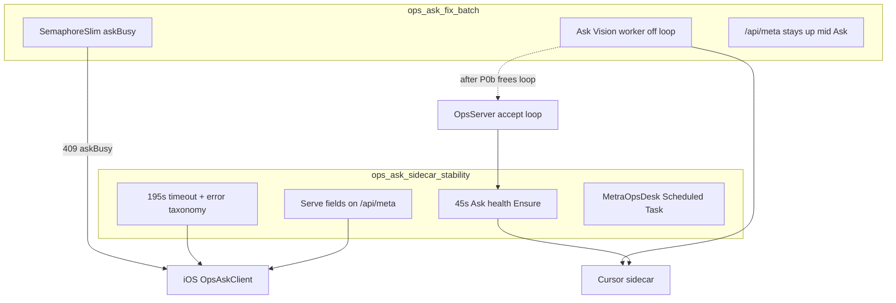

# Ops / Ask sidecar stability

**Stem:** `ops-ask-sidecar-stability`
**Product:** Metra Ops host + Cursor Ask sidecar + iOS Ops Ask client
**Status:** Approved (Bing 2026-09-21). Three non-blocking amendments folded below. Surveyor Pack/Approve / Yarn index still pending operator before implement.
**Parent:** [`ops_ask_conflict_parent_6578644c.plan.md`](ops_ask_conflict_parent_6578644c.plan.md) (stem `ops-desk-ask-sequencing`) - Track A step 1. Do not ship fix_batch P0b before this plan's reach bites unless the operator records an override on the parent.
**Yarn / Surveyor (after affirm):** This Cursor leaf (`ops_ask_sidecar_stability_79118c68.plan.md` under `%USERPROFILE%\.cursor\plans\`) is the working body. Prefer `authority: cursor` - Surveyor Pack Plan → Approve Plan, or `.\metra.ps1 yarn plan approve -Path <this leaf> -Confirm` to upsert [`plans/index.yaml`](plans/index.yaml) (stem + `cursorLeaf`; **does not** copy the body into `plans/`). Do not hand-author a duplicate `plans/*.plan.md` scar unless you explicitly want a repo twin later. Do not reopen [`tailscale-identity-auth`](plans/tailscale-identity-auth.plan.md) or [`ask-conversation-execution`](plans/ask-conversation-execution.plan.md) for this bite.
**Sibling plans:** [`ops_ask_fix_batch_a72e390d.plan.md`](ops_ask_fix_batch_a72e390d.plan.md) (DEV-JMP01 resource / Ask off accept-loop - **complementary; see Relationship below**); [`sidecar_complete_fix_c71cd0e0.plan.md`](sidecar_complete_fix_c71cd0e0.plan.md) (shipped foundation this plan builds on - keep SDK pin at Decision **1.0.26**, not that plan's obsolete 1.0.30 todo).
**Related (cite only):** [`plans/ios-companion-app.plan.md`](plans/ios-companion-app.plan.md), Decisions 2026-08-30 (sidecar recovery / `@cursor/sdk` **1.0.26** pin), 2026-08-01 (desktop Host - revise reach-layer only), 2026-08-27 (campus hosts / Serve).
**Out of scope:** Loom/Pulse/Scout (`implementer-run.mjs`), Funnel, Windows Service SCM rewrite of the tray UI, `@cursor/sdk` bump past 1.0.26, lowering consecutive-error health threshold to 1, **and anything owned by ops_ask_fix_batch** (Ask worker offload, SemaphoreSlim gate, Attention Project/Reconcile, token caps).

## Bing review (2026-09-21)

**Verdict:** Approve. Non-blocking amendments A (poll interval from prior completion), B (`/api/meta` additive-only), C (`degradedCode` clear on healthy success) folded into Design decisions B–D below. Parent sequencing consistency checked - no conflict.

---

## Root-cause confirmation

| # | Claim | Verdict | Evidence |
|---|--------|---------|----------|
| 1 | Client 45s vs server 180s; timeout → offline | **Confirmed** | [`OpsAskClient.swift`](clients/ios/MetraCompanion/Services/OpsAskClient.swift) `timeoutInterval = 45`; `URLError.timedOut` → `AskClientError.offline`. [`AskEngine.ps1`](scripts/private/AskEngine.ps1) `Invoke-MetraAskEngine -TimeoutSec 180`. Vision path ([`VisionAsk.ps1`](scripts/private/VisionAsk.ps1) ~871) does **not** pass `TimeoutSec`; CE [`AskConversation.Engine.ps1`](scripts/private/AskConversation.Engine.ps1) only forwards when `TimeoutSec -gt 0`. |
| 2 | No periodic Ask sidecar health poll | **Confirmed** | Tray timer ([`OpsHost.ps1`](scripts/private/OpsHost.ps1) ~1060-1199) is **desk PID / port adoption only** (by design: mid-Ask must not look dead). Sidecar Ensure ([`AskEngine.ps1`](scripts/private/AskEngine.ps1) `Invoke-MetraAskCursorSidecarEnsure`) runs on inbound Ask / start, not on a timer. |
| 2b | Watchdogs miss wedged-but-alive | **Partially already solved if polled** | `Test-MetraAskCursorPortHealth` uses **1s** `Invoke-RestMethod` on `/health`. A stuck Node event loop fails that probe. Gap is cadence, not probe design. |
| 3 | Auth/billing excluded from health gate; surfaces as offline | **Confirmed with nuance** | [`session-cache.mjs`](engines/cursor/session-cache.mjs) `countsTowardHealthGate` correctly excludes auth/usage/model. Desk already formats those codes in `Format-MetraAskEngineUnavailableMessage` ([`AskEngine.ps1`](scripts/private/AskEngine.ps1) ~1954+). **Vision collapses** them to `reason: engine_failure` ([`VisionAsk.ps1`](scripts/private/VisionAsk.ps1) ~930-933). iOS has no auth/usage cases ([`AskClient.swift`](clients/ios/MetraCompanion/Services/AskClient.swift)). |
| 4 | Serve fails silently; iOS needs HTTPS | **Confirmed** | [`OpsServe.ps1`](scripts/private/OpsServe.ps1) 12s CLI timeout preserved. Fail → `Write-Warning` only ([`OpsServer.ps1`](scripts/private/OpsServer.ps1) ~2131-2134). Binding already has `Serve` / `ServeError` ([`OpsBinding.ps1`](scripts/private/OpsBinding.ps1)). **`GET /api/meta` returns only version/root** (~522-526) - no Serve/Ask fields. iOS `askURL(from:)` requires `https`. |
| 5 | Hard-kill orphans sidecar until next Ask/start | **Confirmed** | `finally` Stop-Ask only on clean exit ([`OpsServer.ps1`](scripts/private/OpsServer.ps1) ~2303-2304). Orphan adoption only inside Ensure. |
| 6 | Startup shortcut only; no unattended reach | **Confirmed** | `Set-MetraOpsHostStartup` + Decision 2026-08-01 desktop-before-service; Decision notes Scheduled Task for **tray** revival deferred. |

**Preserve (do not regress):** tray PID watchdog + 5/15/60/300s backoff; "process alive mid-Ask ≠ dead"; orphan-listener adoption + foreign-process guard; retire-then-dispose lease; `@cursor/sdk` **1.0.26** pin; 12s Tailscale CLI timeout; Host→Ops→Ask ownership (tray never starts Ask directly).

---

## Design decisions (locked)

### A. Timeouts + retries (#1)

**Align client above server; do not shorten the server budget for phone Ask.**

| Layer | Budget |
|-------|--------|
| Server `Invoke-MetraAskEngine` (Vision + desk) | Keep **180s** |
| iOS `URLRequest.timeoutInterval` | Raise to **195s** (180 + margin) |
| Optional connect-class retry | **One** retry, 1-2s backoff, **only** for early reachability (`cannotConnectToHost`, `dnsLookupFailed`, `cannotFindHost`, `networkConnectionLost` **before** a long wait). **Never** retry on `timedOut` after a full budget |

**Why not server-first short timeout / "still working":** Ops accept loop is single-flight; mid-request progress responses would require async Ask workers (rewrite). Raising the client timeout closes the false-offline class without that.

**Idempotency / lease:** Vision uses stable `vision:$deviceKey`. A client retry while the server is still inside `/v1/complete` would double-lease the same agent (`activeRuns`). That is why **timeout retries are forbidden**. `turnId` today is client-only (not a server dedup key); do **not** add turnId dedup in this bite unless a cheap no-op map proves necessary in tests.

**Copy:** Split `timedOut` from true offline in `AskClientError` (e.g. `.requestTimedOut` vs `.offline`) so UI does not say "unavailable offline" for a slow success window that still failed.

### B. Periodic Ask health poll (#2 + #5)

**Owner: Ops desk (not tray)** - preserves Host→Ops→Ask.

Inside [`Start-MetraOpsServer`](scripts/private/OpsServer.ps1) accept loop (already wakes every 250ms): every **45s**, if Cursor engine selected:

1. `Test-MetraAskCursorPortHealth -TimeoutSec 1`
2. On failure → `Invoke-MetraAskCursorSidecarEnsure` (existing adopt / recycle / foreign-guard path)

**Poll interval (Bing Amendment A):** The 45s cadence is measured from **completion of the previous poll attempt** (including any Ensure recycle time), not from a fixed wall-clock schedule. If Ensure runs long, the next poll waits 45s after that attempt finishes.

**Wedge:** the existing 1s `/health` probe **is** the liveness probe - no second mechanism. Document that TCP listen alone is insufficient; Boolean `ok` + timely response both required (already Ensure policy per Decision 2026-08-30).

**Orphans after hard kill (#5):** same poll adopts listeners via Ensure - **sufficient**; no separate orphan sweeper.

**Tray:** unchanged desk PID supervision. Optional later: tray balloon if Ops exposes Ask degraded via heartbeat - not required for v1 if `/api/meta` + Serve balloons cover operator visibility.

### C. Auth / billing / model visibility (#3)

Keep **no-recycle** for `cursor_auth_error` / `cursor_usage_limit` / `cursor_model_unavailable`.

| Layer | Change |
|-------|--------|
| `getHealthPayload` | Keep `ok` semantics. Add `lastClassifiedError` / `degradedCode` (nullable) updated when classified non-recycling failures occur so `/health` can show "up but degraded." |
| VisionAsk | Map engine `errorCode` → Vision `reason` (`cursor_auth_error`, `cursor_usage_limit`, `cursor_model_unavailable`) instead of blanket `engine_failure`; put sanitized detail in `detail`. |
| OpsAskClient / AskClientError | Distinct cases + LocalizedError copy (auth key, usage/billing, model pin). Do **not** map these to `.offline`. |
| Desk Ask | Already has operator-facing formatters - leave; ensure CE/Vision paths do not strip `errorCode`. |

**`degradedCode` lifecycle (Bing Amendment C):** Set when a classified non-recycling failure is recorded. **Clear after a successful healthy operation** (e.g. `/v1/complete` finished with success, or `recordRunFinished` / equivalent path that already resets consecutive run errors). Do not leave stale auth/billing/model degradation visible after the sidecar has completed a healthy Ask again. Clearing does **not** imply recycling the process.

### D. Serve failure visibility (#4)

| Surface | Change |
|---------|--------|
| Ops start | On `Enable-MetraOpsTailscaleServe` failure when `bindTailscale`: **one** tray balloon if Host is up ("Tailscale Serve HTTPS failed - phone Ask needs HTTPS") **and** keep warning log. Persist `ServeError` on binding (already). |
| `GET /api/meta` | Extend with non-secret reach facts: `shareUrl`, `serveOk`, `serveError`, `bindTailscale`, `askEngine` summary (`selected`, `healthy`, `degradedCode`). Keep Ask-class readable (no local-authority secrets). |
| iOS Settings | Lightweight `GET /api/meta` (short timeout). Map: connect fail → offline/unreachable; `serveOk:false` → explicit "Serve HTTPS is down on the Ops host"; `degradedCode` → auth/billing copy. |

**`/api/meta` contract (Bing Amendment B):** New fields are **additive only**. Existing clients that ignore unknown JSON properties must keep working. Do not rename or remove `version` / `metraRoot` / `homeLabel` in this bite; do not require new fields for desk or CLI callers that only read the old shape.

Do **not** weaken HTTPS requirement on the phone. Do **not** re-open Funnel. Campus DNSFilter fix stays [`docs/playbooks/tailscale-campus.md`](docs/playbooks/tailscale-campus.md) - surface that hint in Serve error text (already partially in OpsServe).

**Conflict avoidance with tailscale-identity-auth:** this plan owns reach/health UX only; pairing/WhoIs/device tokens stay in that plan.

### E. Unattended persistence (#6) - explicit call

**Call: Scheduled Task for Ops+Ask reach; keep tray as interactive UX. Do not turn the tray into a Windows Service.**

| Piece | Runs how |
|-------|----------|
| Ops desk + Ask sidecar | New task `MetraOpsDesk` - At startup, **run whether user is logged on or not**, as the HQ user account that owns `%LOCALAPPDATA%\Metra` + Cursor key, starting headless `Start-MetraOpsServer -NoBrowser` (or thin wrapper). Restart-on-failure policy on the task. |
| Tray Host | Remains optional interactive supervisor (Startup shortcut). When present, **adopts** the already-running desk (existing adopt path). Balloons / Settings Open only when logged on. |
| Windows Service (SCM) | **Still deferred** - Task covers unattended reach without rewriting Host as a service. |

**Decision scar to revise:** 2026-08-01 "desktop app before a service" → Host **UX** stays desktop; **reach layer** (Ops+Ask) may run via Scheduled Task for Tailscale inquiries without interactive logon. Tray-revival-via-Task remains unnecessary if Ops Task keeps the desk up.

**Tradeoffs (accepted):**

- Task needs stored user credentials (or equivalent) for "whether logged on"; document install via `.\metra.ps1 host task install -Confirm`.
- Tailscale must be machine-service mode so Serve works without a desktop session (document prerequisite).
- Host Open / proposal apply balloons only when tray session exists - acceptable for remote Ask goal.
- Rejected alternative: auto-logon + Startup tray only (brittle, leaves desk down if tray killed).

---

## Implementation bites (after approval)

0. **Yarn gate** - Surveyor Pack/Approve (or `yarn plan approve -Path` this leaf); index stem `ops-ask-sidecar-stability` with `authority: cursor`; revise Decision 2026-08-01 reach-layer note. No forced `plans/` scar.
1. **Server poll** - OpsServer accept-loop 45s Ask Ensure; unit/smoke: kill sidecar PID, assert poll restores `/health` without an Ask.
2. **Timeouts / iOS retry** - 195s client; split timeout vs offline; one early-reachability retry; Vision keeps 180s engine default (explicit `-TimeoutSec 180` on Vision invoker for clarity).
3. **Error taxonomy E2E** - session-cache degraded fields; Vision reason mapping; Swift error cases + Chat/Settings copy.
4. **Serve + meta** - balloon + `/api/meta` fields + iOS Settings probe.
5. **Scheduled Task** - install/uninstall/status CLI; docs; Decision update; Pester for registration WhatIf.
6. **Tests / docs** - extend existing Ask sidecar / Vision contract / Ops binding tests; short playbook section under Ops or Cross-Device; no Loom/Scout files.

## Done when

- Slow Cursor replies (45-180s) no longer present as iOS "offline."
- Dead or wedged sidecar recovers within ~45-90s without waiting for the next phone Ask.
- Auth/usage/model failures show distinct phone copy; `/health` stays non-recycling but degraded fields visible.
- Serve provision failure is visible to operator (balloon + meta) and to Settings as Serve-down, not generic offline.
- Hard-kill Ops leaves sidecar recoverable by the Ops poll alone.
- After reboot without interactive logon (with Task installed + Tailscale service), HTTPS Ask over Serve answers.

## Non-goals

- Rewriting Ops to async multi-worker Ask (**owned by** [`ops_ask_fix_batch`](ops_ask_fix_batch_a72e390d.plan.md) P0b).
- Attention Project vs Reconcile, token caps, image normalize, telemetry rotation (**same sibling**).
- Client HTTPS→HTTP fallback.
- Raising `@cursor/sdk` past 1.0.26.
- Implementing WhoIs pairing (other plan).
- Converting NotifyIcon Host into a Windows Service.

---

## Relationship to `ops_ask_fix_batch`

**Different problems, shared desk.**

| Plan | Problem | Center of gravity |
|------|---------|-------------------|
| **ops_ask_fix_batch** (2026-09-08, Bing approve-with-conditions, todos still pending) | DEV-JMP01 CPU/RAM - Ask blocks accept loop; attention reconcile on every payload shape; token/image waste | Offload Ask/Vision to Updates-style worker + `SemaphoreSlim(1,1)` 409 `askBusy`; Attention Project vs Reconcile; cost caps |
| **ops_ask_sidecar_stability** (this plan) | Phone "offline" / remote Tailscale reach - timeout mismatch, silent sidecar death, auth-as-offline, Serve silent fail, no unattended Ops | iOS timeout/retry taxonomy, Ops accept-loop Ask `/health` poll, Serve+meta visibility, Scheduled Task for Ops+Ask |

[`sidecar_complete_fix`](sidecar_complete_fix_c71cd0e0.plan.md) already shipped the lease + consecutive-error `/health` gate + Ensure recycle this plan **extends** (periodic poll + degraded auth surfacing). Do not re-open its completed bites; ignore its obsolete "pin 1.0.30" todo (live Decision is **1.0.26**).

### Where they touch

1. **Accept-loop ownership** - fix_batch P0b removes the scar this plan inherits ("long Ask blocks `/api/meta`", which is why Host uses PID). Stability's 45s Ask poll **piggybacks the current sync accept loop** and stays valid after offload (loop is freer). Do **not** implement the worker here.
2. **Timeout ownership** - both keep engine **180s** as authoritative. Stability only raises the **phone** to 195s and splits timeout vs offline. fix_batch's proof ("overtime Ask → gate released, meta stayed up") is stronger after P0b; stability does not add a second HTTP timer.
3. **409 `askBusy` vs iOS retry** - when P0b lands, a second phone turn while desk/Vision is busy gets **409**, not a hang. Stability's early-reachability retry must **not** treat 409 as offline; map `askBusy` to a distinct `AskClientError` (add to error-taxonomy bite when both ship). Until P0b ships, 409 does not exist.
4. **Sidecar restart coordination** - fix_batch requires a **named mutex** for cross-runspace Ensure/restart once the worker exists. Stability's Ops-loop Ensure today is same-runspace. Sequence: ship stability Ensure-on-timer first; when P0b lands, route **both** poll-triggered and opaque-recovery Ensure through the same named mutex (one coordination primitive - implement in fix_batch, call from poll).
5. **`/api/meta` extension** - stability adds Serve/Ask degraded fields. fix_batch needs meta reachable mid-Ask. Compatible: extend the payload; P0b makes mid-Ask GETs actually work.

### Sequencing (locked preference)

1. **Ship stability first** for remote-reach pain (timeout, poll, error taxonomy, Serve meta, Scheduled Task) under the **current** sync Ask model.
2. **Then** fix_batch P0a → P0b → P1… so offload does not land under a still-lying phone timeout story.
3. **Integration follow-through** (can be a tiny addendum on whichever plan is open): iOS `askBusy` mapping; point the 45s poll at the named mutex Ensure after worker exists.

**Do not merge the plans.** Overlap is `OpsServer.ps1` + Ask Ensure only; merging would mix jump-box CPU work with phone/Tailscale reach work and muddy Bing/Surveyor gates.
