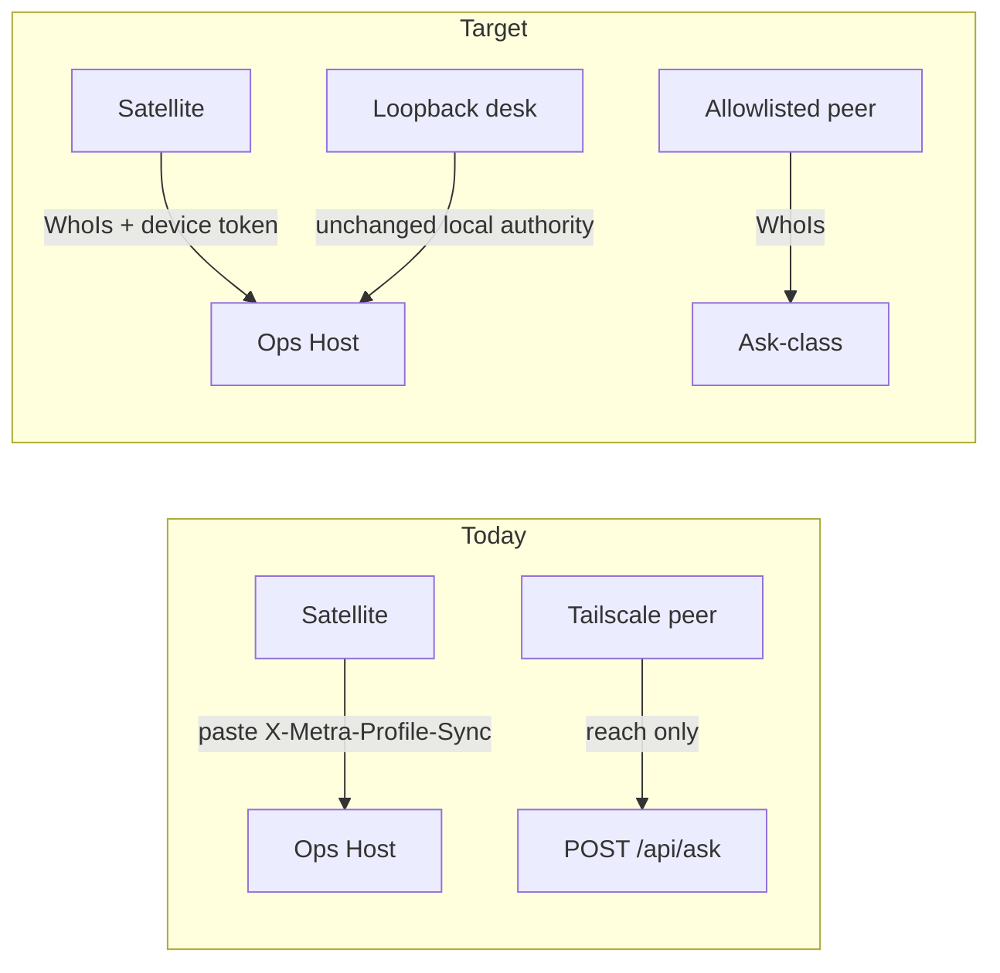

# Tailscale identity auth (Ask + Profile Sync)

**Route:** Metra (`C:\Projects\_meta`) only
**Status:** Approved with minor recommendations (Bing 2026-08-29)
**Architecture label:** Identity-aware transport with local-authority preservation
**Authority scars (unchanged):** Serve ≠ local authority; Ask-class ≠ Host apply / project-tree writes; no derived Tailscale PSK

## Current map (code)

| Concern | Today | Files |
|--------|--------|-------|
| Sync bearer | Single HQ hash `%LOCALAPPDATA%\Metra\profile-sync-token.hash`; client paste in `docs/profile-sync.local.json` / `-SyncToken` / env | [`scripts/private/Profile.ps1`](scripts/private/Profile.ps1) `Initialize-MetraProfileSyncToken`, `Test-MetraProfileSyncToken`, `Test-MetraOpsProfileSyncBearer` |
| Profile HTTP gates | status/export: same-machine \| local-session \| sync bearer; check-in: bearer only; issue-sync-token: local authority | [`scripts/private/OpsServer.ps1`](scripts/private/OpsServer.ps1) ~736–893 |
| Local authority | same-machine (Serve-aware) or `X-Metra-Local-Session` - never Serve alone | [`Test-MetraOpsRequestHasLocalAuthority`](scripts/private/OpsServer.ps1), [`Test-MetraOpsRequestIsSameMachine`](scripts/private/OpsOpen.ps1) |
| Client IP under Serve | `X-Forwarded-For` / `X-Real-IP` via `Get-MetraOpsRequestForwardedClientAddress`; Serve detection already sees `Tailscale-User-Login` headers but does **not** authorize on them | [`scripts/private/OpsOpen.ps1`](scripts/private/OpsOpen.ps1) |
| Ask remote | Open Ask-class - no identity gate beyond reach | `POST /api/ask` ~1145 |
| Satellite happy path | Requires sync token before status/export | [`Sync-MetraProfile`](scripts/public/Profile.ps1), [`Invoke-MetraSatelliteConnect`](scripts/private/Satellite.ps1) |
| Tailscale CLI today | `tailscale status --json`, `serve status` for bind/DNS - no WhoIs yet | [`OpsBinding.ps1`](scripts/private/OpsBinding.ps1), [`OpsServe.ps1`](scripts/private/OpsServe.ps1) |

## Locked policy (this implementation)

1. **Identity source**
   - Serve-proxied: trust Tailscale-injected `Tailscale-User-Login` / node hints only when `Test-MetraOpsRequestLooksProxiedThroughServe` is true.
   - Direct Tailscale listener: resolve client IP (`RemoteEndPoint` or forwarded), then `tailscale whois --json <ip>` on the Ops host. Ignore client-supplied `Tailscale-*` headers on non-Serve paths (spoofable).
2. **WhoIs cache (Bing)** - In-process `$script:MetraWhoIsCache` keyed by client IP, TTL **120 seconds** (within 60–300). Miss → CLI WhoIs; hit → reuse identity record. Fail closed on expired/missing entry. Injectable for tests.
3. **Allowlist** - `docs/client-auth.local.json` (gitignored) + tracked [`docs/client-auth.example.json`](docs/client-auth.example.json). Entries: `login`, `node`, and/or `tag`. Empty/missing allowlist = no new identity gate (transitional); non-empty = enforce.
4. **Pairing** - `POST /api/profile/pair` over Tailscale. Auto-accept when WhoIs matches allowlist **or** matches Self login from `tailscale status --json`. Else pending row; Ops Settings Approve is **local-authority only** (adds identity + mints device).
5. **Device tokens** - Host mints after successful pair. Ledger `%LOCALAPPDATA%\Metra\client-devices.json` stores **token hash plus identity snapshot** (deviceId, label, login, node, tags, issuedUtc, revokedUtc). On each successful validate, update **lastSeenUtc**, **lastIp**, **lastIdentity** (Bing). Client keeps plaintext in `docs/profile-sync.local.json` `syncToken` (header `X-Metra-Profile-Sync`). Revoke one device without rotating a global paste secret.
6. **Replay / bearer semantics (Bing - explicit)** - Device and legacy sync tokens are **long-lived bearers**: possession of a non-revoked token equals authorization for that capability class. **Replay is accepted** (no nonce, no short TTL window in this batch). Revocation is the control plane. Document in SECURITY.md; do not invent nonce machinery now.
7. **Route auth**
   - **Remote sync** (status / export / check-in): allowlisted WhoIs **and** (valid device token **or** legacy break-glass sync hash).
   - **Remote Ask**: when allowlist non-empty, require allowlisted WhoIs; loopback / local-session unchanged; no device token required in this batch.
   - **Break-glass**: `profile issue-sync-token` remains local-authority; token alone still authorizes sync (no WhoIs) so override survives identity glitches.
8. **Non-goals** - no Funnel/public auth; no remote Host apply; no project-tree writes from Tailscale identity; no PSK derived from node keys.
9. **Deferred (not this batch)** - Per-entry `capabilities` (`ask` / `sync`) on allowlist rows. Travel-device ask-only vs workstation ask+sync is a later maturity step.

## Bite order (unchanged sequence; Ask stays after Sync)

### Bite 1 - WhoIs + allowlist (host-only, no HTTP behavior change yet)
- New [`scripts/private/ClientAuth.ps1`](scripts/private/ClientAuth.ps1):
  - `Get-MetraOpsRequestClientIp`
  - `Get-MetraTailscaleWhoIs` (CLI; injectable; **IP cache TTL 120s**)
  - `Get-MetraOpsRequestPeerIdentity` (Serve headers vs WhoIs)
  - `Get-MetraClientAuthConfig` / `Test-MetraClientIdentityAllowed`
- Example + gitignore for `docs/client-auth.local.json`.
- Unit tests with mocked WhoIs JSON (allow / deny / missing CLI / cache hit skips CLI).

### Bite 2 - Device ledger (mint / validate / revoke / list)
- Same file: SHA256 device tokens (mirror sync-token crypto style in Profile.ps1).
- Persist identity snapshot at mint; update lastSeenUtc / lastIp / lastIdentity on validate.
- Expand `Test-MetraOpsProfileSyncBearer` → device ledger **or** legacy `profile-sync-token.hash`.
- CLI: `.\metra.ps1 profile devices`, `profile revoke-device -Id ...` (local authority implied on HQ).
- Tests: mint once, validate, revoke stops validate; lastSeen updates; legacy token still works.

### Bite 3 - Pairing API + pending approve
- OpsServer routes:
  - `POST /api/profile/pair` - WhoIs required; returns device token plaintext once on accept; or `{ pending: true, requestId }`.
  - `GET /api/profile/pair/pending` / `POST /api/profile/pair/approve` / `POST /api/profile/devices/{id}/revoke` - **Assert-MetraOpsLocalAuthority**.
- Pending store: `%LOCALAPPDATA%\Metra\client-pair-pending.json`.
- Tests: allowlisted auto-mint; unknown → pending; approve mints; Serve peer still fails `HasLocalAuthority`.

### Bite 4 - Wire sync gates + Satellite UX
- `Test-MetraOpsProfileSyncAuthorized`: remote path = (legacy token) **or** (WhoIs allowlisted **and** device/legacy bearer). Same-machine / local-session unchanged.
- Check-in: same remote rule (legacy token still ok without WhoIs as break-glass).
- [`Sync-MetraProfile`](scripts/public/Profile.ps1) / [`Invoke-MetraSatelliteConnect`](scripts/private/Satellite.ps1): if no token, call pair then store token; `-SyncToken` remains override. Soften Quiet Satellite warning (token optional when Tailscale pair will run).
- Setup/installer copy: paste token = break-glass, not primary.

### Bite 5 - Ask remote allowlist
- In `POST /api/ask`: if not local-authority and allowlist non-empty → require `Test-MetraClientIdentityAllowed`; else 403 `clientIdentityRequired`. Loopback desk untouched.
- Keep Ask after Sync so identity primitives are proven on the onboarding path first (Bing).
- Test: remote denied without allowlist hit; same-machine ask still works with empty identity.

### Bite 6 - Ops Settings UI + docs
- [`ops/src/App.tsx`](ops/src/App.tsx) Profile Sync: devices list (login/node/lastSeen), pending approve, revoke; relabel Issue/Rotate as break-glass.
- [`ops/src/api.ts`](ops/src/api.ts) + types for new endpoints.
- Docs: Brand glossary (Pair / device token; paste = break-glass); Cross-Device happy path; SECURITY Client identity past “direction” + **explicit bearer replay accepted**; satellite playbook; mark [`docs/tailscale-identity-auth.plan.md`](docs/tailscale-identity-auth.plan.md) shipped bits.
- Append Decision only if behavior diverges from 2026-08-29 (prefer not).

### Bite 7 - Regression pack + Inspect
- Extend [`tests/Metra.ProfileSync.Tests.ps1`](tests/Metra.ProfileSync.Tests.ps1) + Serve≠authority cases in [`tests/Metra.Tests.ps1`](tests/Metra.Tests.ps1).
- After the meaningful batch: `.\metra.ps1 inspect loop -Name Metra`; fix affirmed findings; Bing `inspect pack` after loop, not between rounds.

## Bing review (folded)

| Recommendation | Disposition |
|----------------|-------------|
| WhoIs cache TTL 60–300s | **In scope** - Bite 1, TTL 120s |
| Identity snapshot on device records | **In scope** - Bite 2 |
| lastSeen / lastIp / lastIdentity on validate | **In scope** - Bite 2 + UI Bite 6 |
| Explicit replay-token documentation | **In scope** - policy §6 + SECURITY Bite 6 |
| Keep Ask after Sync in bite order | **Confirmed** |
| Per-capability allowlist (`ask`/`sync`) | **Deferred** - not this batch |

## Done when
- Satellite syncs with Tailscale + allowlisted identity (or one Ops approve) without pasting a token.
- One device revoke stops that client; others keep working.
- Ops can list devices with identity + last-seen metadata.
- SECURITY documents bearer replay = accepted; revocation is the control.
- Existing Serve≠local-authority and Ask-class≠apply tests still pass; remote Host apply not loosened.
- Break-glass `issue-sync-token` still works as override.
